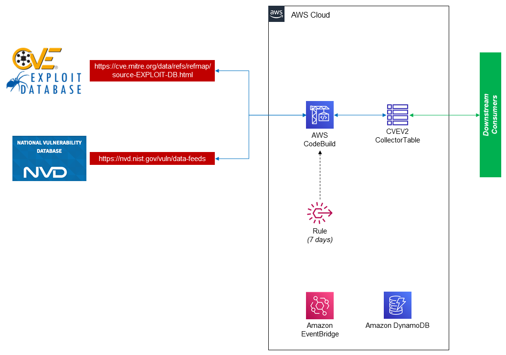

# NVD Data Feeds Collection

## Background

This repository contains all architecture and development artifacts for the purpose of collecting CVE metrics (CVSS) from [NIST's National Vulnerability Database (NVD)](https://nvd.nist.gov/vuln/data-feeds) and its matching Exploit Database ID from [MITRE's CVE Reference Map](https://cve.mitre.org/data/refs/refmap/source-EXPLOIT-DB.html).

MITRE has mapped ExploitDB IDs to CVE IDs and placed them in an HTML table on their website.
NVD's JSON Vulnerability Feeds include a description and associated reference links from the CVE dictionary feed, as well as CVSS base scores, vulnerable product configuration, and weakness categorization for each vulnerability.
We will be collecting the data, merging, and writing it to a table in DynamoDB every 7 days. You can skip all the AWS elements and run the script `cveV2.py` to get a merged JSON file.

## Solution Architecture

## FAQ

### 1. What does this solution do?

This solution will automate the collection of CVE ID numbers that are linked to Exploit IDs that are identified by MITRE, CVE metrics that are maintainted by NIST, and write those findings to persistent storage (DynamoDB).

Services downstream of this collection will be able to enrich, relate, and report on various data points collected such as vulnerabilities, and the rank-ordering of vulnerabilities for the purpose of remediation and/or hardening recommendations.

### 2. What is an exploit?

An [exploit](https://www.rapid7.com/fundamentals/vulnerabilities-exploits-threats/) is the means by which an adversary can leverage a vulnerability. Exploits can be a variety of items ranging from software to commands and even open-source exploit code.

### 3. What is CVE?

[CVE](https://cve.mitre.org/index.html) stands for Common Vulnerabilities and Exposures. This MITRE website contains a list of entries,
each with its own identification number, description, and at least one public reference for publicly known cybersecurity vulnerabilities.

### 4. What is ExploitDB?

ExploitDB is a publically available archive of security exploits and software that is known to be vulnerable. Each exploit is given an Exploit ID to be used in the Exploit DB. Oftentimes, these exploits will be matched with a [CVE ID](https://cve.mitre.org/cve/identifiers/).  

### 5: What is CWE?

> [Common Weakness Enumeration (CWE)](https://cwe.mitre.org/) is a community-developed list of software and hardware weakness types. It serves as a common language, a measuring stick for security tools, and as a baseline for weakness identification, mitigation, and prevention efforts.

### 6. What is NVD?

> The [National Vulnerability Database (NVD)](https://nvd.nist.gov/) is the U.S. government repository of standards based vulnerability management data represented using the Security Content Automation Protocol (SCAP).
This data enables automation of vulnerability management, security measurement, and compliance. The NVD includes databases of security checklist references, security-related software flaws, misconfigurations, product names, and impact metrics.

### 7. What is CVSS?

> The [Common Vulnerability Scoring System (CVSS)]((https://nvd.nist.gov/vuln-metrics/cvss)) is an open framework for communicating the characteristics and severity of software vulnerabilities.
CVSS consists of three metric groups: Base, Temporal, and Environmental. The Base metrics produce a score ranging from 0 to 10, which can then be modified by scoring the Temporal and Environmental metrics.
A CVSS score is also represented as a vector string, a compressed textual representation of the values used to derive the score.
Thus, CVSS is well suited as a standard measurement system for industries, organizations, and governments that need accurate and consistent vulnerability severity scores.
Two common uses of CVSS are calculating the severity of vulnerabilities discovered on one's systems and as a factor in prioritization of vulnerability remediation activities.
The National Vulnerability Database (NVD) provides CVSS scores for almost all known vulnerabilities.

## Contributing

To contribute to this repo create another fork based on master and open a PR. Update the code, code comments, readme and architecture as required.
